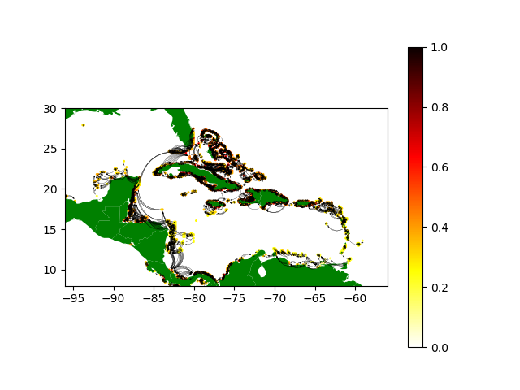

# dPCkCalc

A package for calculating and visualizing the dPCk of patches in a fragmented landscape and associated metrics as described by Saura & Rubio (2010) in the paper "A common currency for the different ways in which patches and links can contribute to habitat availability and connectivity in the landscape". 

To get information on how to use some of the functions in this package, type help("function_name") in the python console after importing the function.

To install: 
```
pip install git+https://github.com/RyDe4/dPCkCalc
```

### Troubleshooting
If you encounter errors during installation, try forcing installation without dependencies:

```
pip install git+https://github.com/RyDe4/dPCkCalc --no-deps
```
You can then install the dependencies independently. numpy and igraph are required for most of the functions in the PcCalc modules, and numpy, igraph, descartes, shapely, geopandas, and seaborn are required for many of the functions in the Visualization module.

Currently, the modules for this package must be imported independently. The two modules are PcCalc and Visualization

### Gallery




